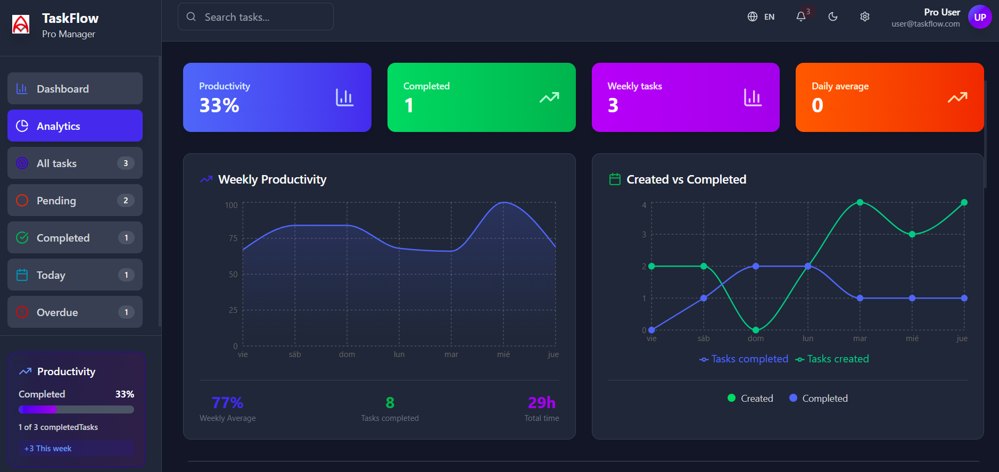

# TaskFlow Pro Manager

A modern and intuitive task management application built with React and Vite. Stay organized and boost your productivity with a clean, responsive interface.

## 📸 Screenshot



## ✨ Features

- 📋 **Task Management** - Create, edit, and organize your tasks
- 📊 **Analytics Dashboard** - Track your productivity with detailed metrics
- 🌍 **Bilingual Support** - Available in English and Spanish
- 🌙 **Dark/Light Mode** - Choose your preferred theme
- 📱 **Responsive Design** - Works perfectly on desktop and mobile
- ⚡ **Real-time Updates** - Instant task status changes
- 🎯 **Priority System** - Organize tasks by priority levels
- 📅 **Due Dates** - Never miss a deadline
- 🔍 **Smart Search** - Find tasks quickly with advanced filtering

## 🚀 Getting Started

### Prerequisites

- Node.js (v16 or higher)
- npm or yarn

### Installation

1. Clone the repository
```bash
git clone https://github.com/yourusername/task-manager-app.git
cd task-manager-app
```

2. Install dependencies
```bash
npm install
```

3. Start the development server
```bash
npm run dev
```

4. Open your browser and visit `http://localhost:5173`

## 🛠️ Built With

- **React** - Frontend framework
- **Vite** - Build tool and dev server
- **Tailwind CSS** - Utility-first CSS framework
- **React i18next** - Internationalization
- **Lucide React** - Beautiful icons
- **Context API** - State management

## 📦 Project Structure

```
src/
├── components/         # Reusable UI components
│   ├── features/      # Feature-specific components
│   ├── layout/        # Layout components
│   └── ui/            # Basic UI components
├── contexts/          # React contexts
├── hooks/             # Custom hooks
├── i18n/              # Internationalization
├── pages/             # Page components
└── assets/            # Static assets
```

## 🌍 Language Support

- **English** - Default language
- **Español** - Full Spanish translation

Switch languages using the globe icon in the header.

## 🎨 Themes

Toggle between light and dark modes using the theme switcher in the header.

## 📝 License

This project is licensed under the MIT License - see the [LICENSE](LICENSE) file for details.

## 🤝 Contributing

Contributions are welcome! Please feel free to submit a Pull Request.

## 📧 Contact

Alex Aleman
alxaleman@gmail.com